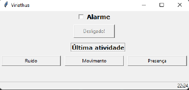
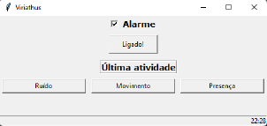
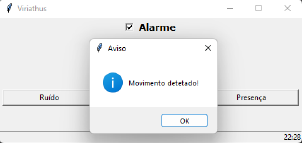
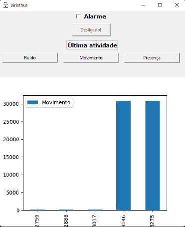

# Viriathus - IoT Security and Monitoring Project

## Introduction
Welcome to the "Viriathus - IoT Security and Monitoring Project" repository. This project, created by Nuno Cunha and Miguel Vasques, was developed as part of our Internet of Things (IoT) course at the University of Coimbra, Faculty of Science and Technology. The primary goal of this project is to create a system that monitors and enhances the security and efficiency of a residential space through the use of IoT technology.

## Project Overview
In this project, we aimed to achieve the following objectives:

* Acquire data related to noise levels, movement, and room-to-room transitions within a building using various sensors.
* Store the collected data in a database for further analysis.
* Utilize the sensor data to implement a reliable security and monitoring system for the residential space.
* Develop a feature to study routines within the residence to enhance its efficiency.
* Implement an alert mode that mimics a typical security system.
* Create a user-friendly application that allows users to receive real-time information and take actions remotely, such as activating or deactivating the alarm mode.

## Key Components
The project uses the following hardware components and technologies:

* Zolertia REmote development platform for wireless sensor networks.
* Noise sensor: Utilizes an LM2904 amplifier and a built-in microphone to amplify and filter high-frequency signals.
* PIR (Passive Infrared) motion sensor: Detects electromagnetic radiation in the infrared range and is used to sense movement.

## Communication

In the communication aspect of this project, tunslip6 replaces the border router to connect the boards to the server, which is hosted on Amazon Web Services (AWS). It creates an IP bridge between the host (Zolertia board) and the server, establishing a virtual network on the host and using the SLIP (Serial Line Internet Protocol) to transport IP traffic to its destination. While the principle remains the same, the data transmission to the cloud leverages the MQTT (Message Queuing Telemetry Transport) protocol in JSON format, following a similar process to the one employed in practical classes. 

Data is sent to the cloud as soon as it is acquired. In terms of security, AWS supports secure MQTT connections through TLS (Transport Layer Security) or SSL (Socket Service Layer). For data storage, we utilize AWS DynamoDB, which listens to an MQTT topic and automatically stores the data in a dynamic table.

## User Interface

The User Interface (GUI) is a Python application that runs in a computer terminal. It was developed with the assistance of various libraries, including boto3 for handling cloud-based data stored in the table and tkinter for the graphical interface. This user interface provides a simplified interaction for the user. It allows users to enable or disable an alert mode and receive notifications if this mode detects any motion or noise. Additionally, users can query and view the latest activities categorized by noise, motion, or presence.

 

  
   
  <em>Fig. 1 - Initial Graphical Interface</em>

    
    
    
<em>Fig. 2 - GUI with Alarm Activated and Notification when Something is Detected</em>

  
   
  <em>Fig. 3 - Graphical Interface - Last Activity of PIR Motion Sensor</em>

